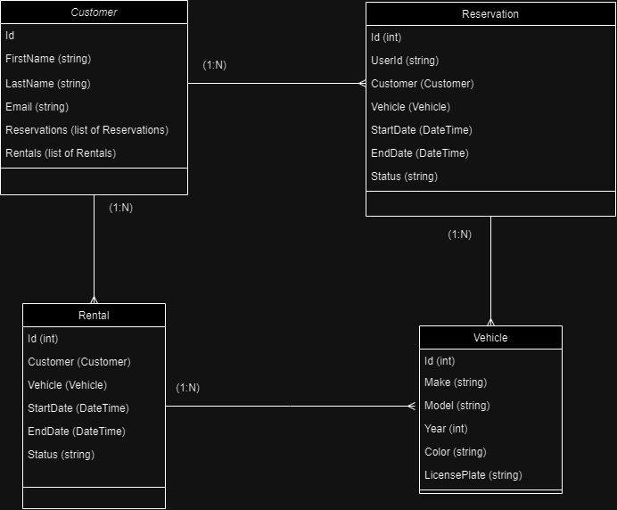

# Miles Cart Rental API

API para el manejo de la renta de vehículos de la empresa Miles Car Rental.

Autor: [Sebastian Castellanos  Patiño](https://github.com/sebastian-ksk)

## Desarrollo de Prueba Tecnica

## 1.
La empresa Miles Car Rental requiere el desarrollo de una aplicación para el
manejo de la renta de sus vehículos. Inicialmente, necesitan que cuando un
cliente realice una solicitud de un vehículo, la aplicación liste las diferentes
opciones que ofrece la compañía y que pueda almacenar la información del
cliente, sus preferencias, así como realizar reservas y finalizar la renta del
vehiculo. Dado que se encuentra en una fase exploratoria, se solicitan los
siguientes entregables:

## A. Diagrama de Clases

El diagrama de clases de nuestro proyecto ilustra la estructura de los modelos y
sus relaciones dentro de la aplicación de alquiler y reservación de vehículos.
Los modelos principales incluyen Customer, Reservation, Rental, y Vehicle, 
cada uno con propiedades específicas que reflejan los requisitos y características del dominio de la aplicación.

- **Reservation**: Refleja una reserva hecha por un cliente, con propiedades como `Id`, `CustomerId`, `VehicleId`, `StartDate`, `EndDate`, y `Status`.

- **Rental**: Similar a `Reservation`, pero para alquileres. Incluye `Id`, `CustomerId`, `VehicleId`, `StartDate`, `EndDate`, y `Status`.

- **Vehicle**: Detalla los vehículos disponibles, con `Id`, `Make`, `Model`, `Year`, `Color`, y `LicensePlate`.

### Relaciones

- **Clientes a Reservaciones y Alquileres**: Una relación uno a muchos, indicando que un cliente puede tener múltiples reservaciones y alquileres.

- **Reservaciones y Alquileres a Clientes y Vehículos**: Relaciones muchos a uno, cada reserva o alquiler está vinculado a un único cliente y vehículo.

## B. Seudocódigo y Explicación de Proyecto

## 2. Consulta SQL

# Procedimientos Almacenados para Consultas Específicas

A Continuacion se describe los procedimientos almacenados implementados en la base de datos 
de la aplicación para realizar consultas específicas relacionadas con itinerarios, reservas
y métodos de pago. Cada procedimiento almacenado tiene un objetivo claro y facilita la recuperación
y gestión eficiente de la información dentro de la aplicación. Ubicado en el proyecto  `MilesCarRental.SQL`

##  SP_CountItinerariesOverOneThousand

- **Objetivo**: Contar usuarios con consultas de itinerarios > $1000.
- **Variables**: `Valor` (itinerario).

## SP_UsersOver40InBogotaWithReservations

- **Objetivo**: Identificar usuarios > 40 años en Bogotá con reservas.
- **Variables**: `Edad`, `Ciudad` (usuario).

## SP_ReservationsByCreditCard

- **Objetivo**: Listar reservas pagadas con tarjeta de crédito.
- **Variables**: `MetodoPago` (reserva).

## SP_ReservationsPayOnArrival

- **Objetivo**: Listar reservas con pago en destino.
- **Variables**: `MetodoPago` (reserva).

## SP_ActiveAndCancelledReservations

- **Objetivo**: Mostrar reservas activas y canceladas.
- **Variables**: `Estado` (reserva).

---
